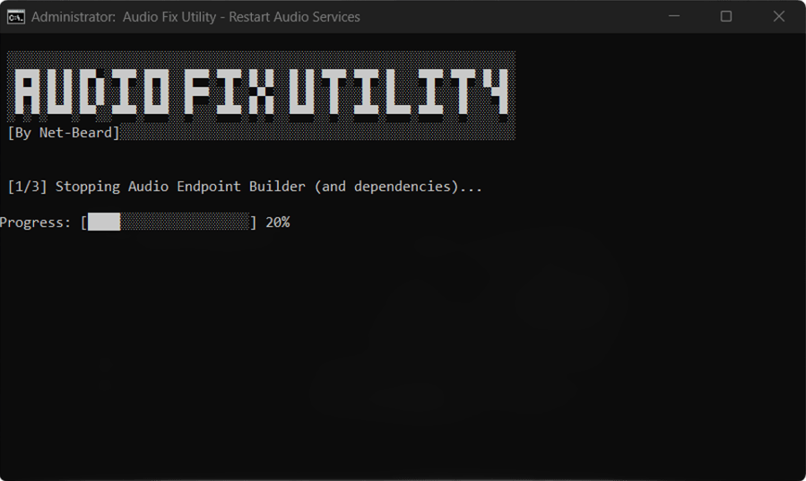
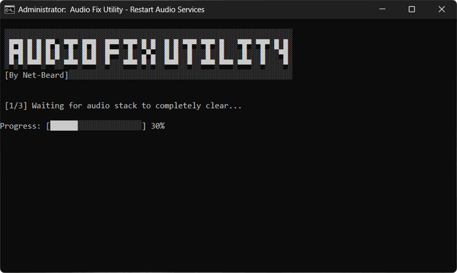
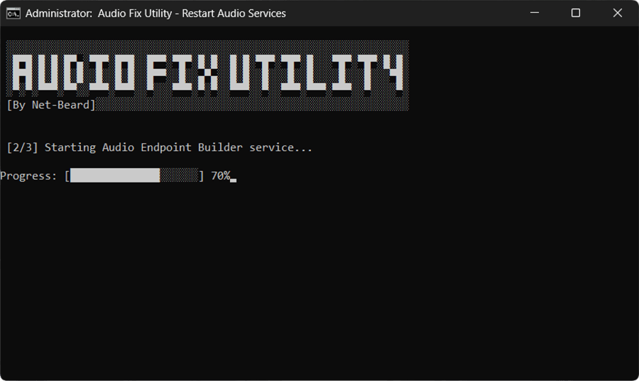
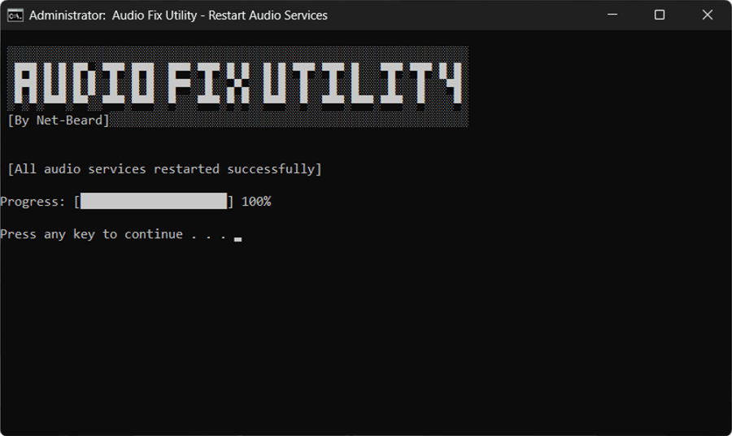

# Windows Audio Refresher

Windows Audio Refresher is a small Windows batch script that restarts the Windows audio services to help recover from audio issues. It is useful when sound stops working or the audio service becomes stuck after sleep, startup, or other system state changes.

The script is intended for quick troubleshooting and can be run manually on affected Windows machines to refresh the audio stack without restarting the entire computer.

While it is not created as a permanent solution I hope it helps to easily restore sound on
Windows machines that experience such problems. 

Cheers!

## Instructions & Download

- ⬇️ Download [WindowsAudioRefresher.bat](https://github.com/net-beard/windows-audio-refresher/releases/latest/download/WindowsAudioRefresher.bat)
- 🛡️ Run as Administrator

## Screencaps

| Stopping audio services | Clearing the audio stack |
| --- | --- |
|  |  |

| Restarting the audio service | Refresh completed successfully |
| --- | --- |
|  |  |
